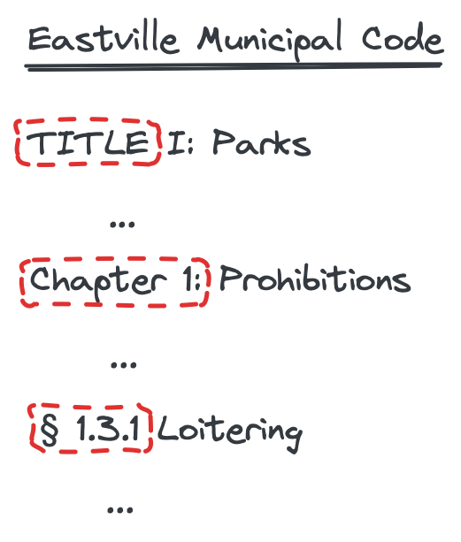
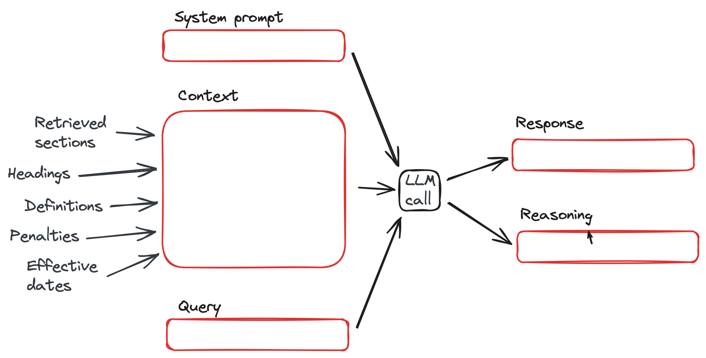

# Large Language Models for <br>Legal Epidemiology


_Revised version of slides originally presented March 27, 2024_

---
### Agenda

1. Motivation
2. Guiding principles
3. Prototype walk-through
4. What's next?
5. Thoughts; discussion

---
### Motivation

- Answering research questions about municipal laws requires analysis of hundreds of jurisdictions
- Limited time and resources $\rightarrow$
    - team has to decide on a fixed set of questions in advance
    - it takes many months to complete the analysis
    - hard to do updates or track changes
- Can language models ...
    - improve speed, efficiency, accuracy, and reuse?
    - enable a dynamic approach to formulating questions?

---
### Guiding principles

1. Ground all results with citations and retrieved source excerpts
2. Find all relevant sources!
3. Keep humans in the loop – design, verify, solve problems
4. To extent possible, minimize complexity and external dependencies

---
### Prototype: overview


---
### Prototype: status


---
### Downloading codes

- Harder than it seems
- Multiple online publishers
- Unreliable file formats, need for workarounds
- E.g., to get clean files, download `.docx` and convert:

```
$ pandoc -t plain -o eastville-code.txt eastville-code.docx
```

---
### Parsing



- Want to segment cleanly according to code hierarchy
- Each jurisdiction uses a different system
- OTS tools don't really work

---
### Parsing: heading spec

```Python
chicago = Jurisdiction(
    name="Chicago",
    hierarchy={
        "title":   r"TITLE \d+",
        "chapter": r"CHAPTER \d+-\d+",
        "article": r"ARTICLE [IVX]+\\.",
        "section": r"\d+-\d+-\d+",
    },
    source_local="../data/chicago/chicago.txt",
)
chicago_tree = chicago.parse()
```

---
### Parsing: spec for another jurisdiction

```Python
los_angeles = Jurisdiction(
    name="Los Angeles",
    hierarchy={
        "chapter": r"CHAPTER [IVX]+[A-Z]?",
        "article": r"ARTICLE \d+",
        "section": r"SEC. \d+\.\d+",
        "subsection": r"[A-Z]\.",
    },
    source_local="../data/los-angeles/los-angeles.txt",
)
los_angeles_tree = los_angeles.parse()
```

---
### Storing processed data

```Python
with conn.cursor as cursor:
    cursor.execute(
        """
        CREATE TABLE IF NOT EXISTS muni (
            id SERIAL PRIMARY KEY,
            jurisdiction TEXT,
            L1_ref TEXT, L1_heading TEXT, L2_ref TEXT, L2_heading TEXT,
            L3_ref TEXT, L3_heading TEXT, L4_ref TEXT, L4_heading TEXT,
            segment INTEGER,
            text TEXT,
            embedding VECTOR(%s)
        );
        """, (EMBEDDING_LENGTH,))
```

---
### Identify associations among sections (1 of 2)


---
### Identify associations among sections (2 of 2)

```Python
system_prompt = """
You will be given a text block, which may provide context about other parts of
the document (a municipal code or ordinance) from which it was taken.

Your task is to classify the text block. Your response should be a single word
from the following list, choosing the best fit according to the explanation
provided on each line:

    'rule': Statement of a rule, obligation, or prohibition,
    'penalty': Penalties for violations of rules specified in other parts of the code,
    'definition': Definition of terms used in other parts of the code,
    'interpretation': Guidance about interpretation of language or rules, other than definitions,
    'date': Effective dates of rules in the document or enacting legistlation, or termination dates,
    'other': Any other type of context not covered by the above categories,
"""
```

[_Passed to LLM API call_ ]

---
### Embeddings & search


- Vector similarity in embedding space allows efficient semantic search
- `pgvector` Postgres extension: fewer dependencies and relational queries
- Combine with query augmentation and keyword searches to cover bases

---
### Embeddings & search

```Python
from openai import OpenAI

EMBEDDING_MODEL = "text-embedding-3-small"

def create_embedding(text: str, model: str=EMBEDDING_MODEL) -> list[float]:
    """Create an embedding for a block of text."""
    client = OpenAI()
    response = client.embeddings.create(input=[text], model=model)
    return response.data[0].embedding
```

`[.453, .765, .023, .114, ...]` $\rightarrow$ _1536 dimensions_

---
### Hybrid search for relevant code sections

```SQL
WITH semantic_search AS (
        SELECT id, L4_heading, RANK () OVER (ORDER BY embedding <=> %(embedding)s) AS rank
        FROM muni
        ORDER BY embedding <=> %(embedding)s
        LIMIT 20
    ),
    keyword_search AS (
        SELECT id, L4_heading, RANK () OVER (ORDER BY ts_rank_cd(textsearchable, query) DESC)
        FROM muni, plainto_tsquery('english', %(query)s) query
        WHERE textsearchable @@ query
        ORDER BY ts_rank_cd(textsearchable, query) DESC
        LIMIT 20
    )
    SELECT
        COALESCE(semantic_search.id, keyword_search.id) AS id,
        COALESCE(1.0 / (%(k)s + semantic_search.rank), 0.0) +
        COALESCE(1.0 / (%(k)s + keyword_search.rank), 0.0) AS score,
        COALESCE(semantic_search.L4_heading, keyword_search.L4_heading) AS L4_heading
    FROM semantic_search
    FULL OUTER JOIN keyword_search ON semantic_search.id = keyword_search.id
    ORDER BY score DESC
    LIMIT %(limit)s;
                                                                                                                        .
```

---
### Use LLM calls to filter responses (1 of 2)

```Python
def is_relevant(text: str, query: str, threshold: int = 4, model: str = LANGUAGE_MODEL) -> bool:
    client = OpenAI()

    system_prompt = """
You will be given a text block and a query. Your task is
to determine whether the text block is relevant to the query. Please respond
with a single integer from 1 to 5 (inclusive), where 1 means 'the text is not
related to, and does not help to answer, the query', 5 means 'the text is
clearly and related to, and helps to directly answer, the query', and
intermediate values represent degrees of relevance in between.
"""
    prompt = f"""
Text block: {text}

Query: {query}

Your response (1, 2, 3, 4, or 5):
"""
            ...                                                                                     .
```

---
### Use LLM calls to filter responses (2 of 2)

```Python
            ...
    response = client.chat.completions.create(
        model=model,
        messages=[
            {"role": "system", "content": system_prompt},
            {"role": "user", "content": prompt}
        ],
        temperature=0.7,
        max_tokens=2,
        top_p=1
    )
    response = response.choices[0].message.content
    if response is not None:
        try:
            if int(response) >= threshold: return True
        except ValueError as e:
            warn(f'WARNING: cannot convert response {response} to integer. Error: {e}')

    return False
                                                                                                        .
```

---
### Assemble relevant context



---
### Retrieve relevant context

```
SEC. 11.00. PROVISIONS APPLICABLE TO CODE.
(l)   In addition to any other remedy or penalty provided by this Code, any
violation of any provision of this Code is declared to be a public nuisance and
may be abated by the City or by the City Attorney on behalf of the people of the
State of California as a nuisance by means of a restraining order, injunction or
any other order or judgment in law or equity issued by a court of competent jurisdiction
...

SEC. 45.00 DEFINITIONS
(a) "BOARD" means the Board of Police Commissioners unless otherwise designated.
...

SEC. 45.19. DISPLAY OF DRUG PARAPHERNALIA TO MINORS
C.   Definitions.
1.   “Drug paraphernalia,” including but not limited to one or more of those
items identified in that list set forth
...                                                                                      .
```

---
### Output results

```
Based on the provided municipal code sections, below are the penalties for
business owners who fail to provide a sign stating that minors are not permitted
to enter an establishment selling drug paraphernalia:

- **Public Nuisance Declaration**: The violation is declared a public nuisance,
which can be abated by the City or the City Attorney through legal means such as
restraining orders, or injunctions (SEC. 11.00 (l)).
- **Injunctive Relief**: The City or City Attorney may seek injunctive relief in
court to enforce compliance with the requirement to post the mandated sign (SEC.
11.00 (l)).
- **Civil Penalties**: Every day the violation continues is considered a new
offense, subject to a maximum civil penalty of $2,500 for each offense (SEC. 11.00 (l)).
- **Performance Bond Requirement**: During civil action, the court may demand
posting of a performance bond to ensure future compliance with the municipal
code and any court orders or judgments (SEC. 11.00 (l)).

These penalties are designed to compel business owners to adhere to the
regulations concerning the display and sale of drug paraphernalia, especially in
relation to minors, as prescribed in SEC. 45.19.                                                    .
```

---
### What's next?

1. Clean up prototype code
2. Expand group of jurisdictions
3. Evaluate against human-coded reference answers
4. Make dev environment easily reproduceable (including database)
5. Create time and resource estimates for full runs on all jurisdictions

---
### Longer term

- Automate parser configuration for each municipal code
- Automate downloads / web scraping?
- Other LLM choices (balance capability, cost, speed, context size)
- LLM program frameworks (LangChain, LlamaIndex)
- LLMs with very large ($\sim1$M token) context windows
- General-purpose document parsers
- Other optimizations (DSPy, model fine-tuning)
- Extending to other research questions

---
# Thoughts? Questions? Suggestions?
